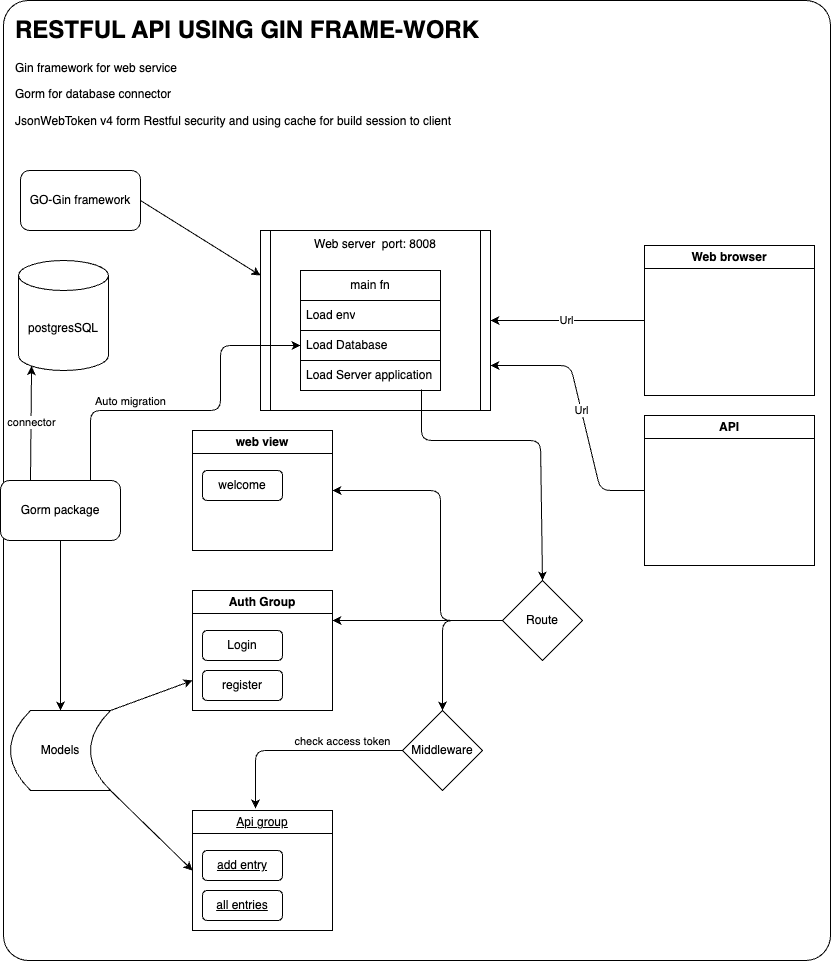
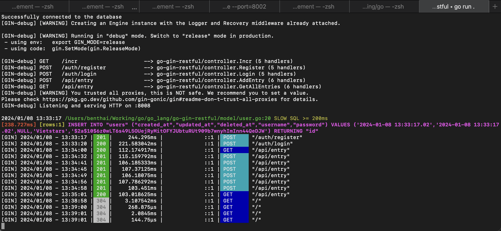
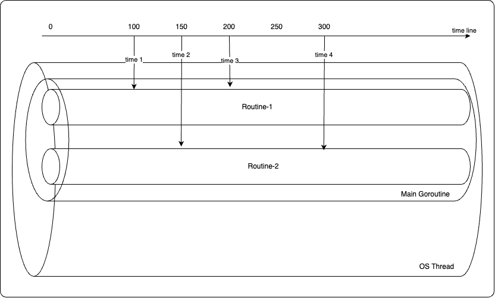

# Go lang

#### Bắt đàu nghiên cứu 09/2007 và được phát triển năm 2008 là ngôn ngữ lập trình mỡ, xử lý đa luồng, song song và tức thời.
##### Tốc độ biên dịch nhanh, cách coding đơn giản và ngắn gọn.

### Biểu tượng là con linh vật Gopher


## Ưu điểm của Go
- Biên dịch (compile language) nhanh chóng code sau khi biên dịch là nhị phân nên mức độ làm việc từ machine nhanh hơn.
- Được phát triển dựa trên cải tiến từ C và C ++ nên Go lang là một ngôn ngữ biên dịch mạnh cho người coder cảm nhận là ngôn ngữ kịch bản (scripting language) hơn là ngôn ngữ biên dich.
- __Tính tương thích cao__ do cách thức xử lý đa luồng nên coder không bị mất quyền truy cập hệ thống khi hệ thống đang xử lý và đông thời Go cũng có thể liên kết với thư viên C ở bên ngoài hoặc xử lý các tác nhiệm Native của hệ thống
- __Tính tiện lợi cao__ vì cảm nhận coding như scripting language nên Go cũng như Python cho coder cảm nhận Go lang có thể đáp ứng mọi nhu cầu lập trình phổ biến nhất. Các tính năng mới đều được cập nhật vào ngôn ngữ chính như __goroutines__ là hàm dành cho concurrency.
- Go có tính năng quản lý cung cấp bộ nhớ xử lý tự động như Python và hỗ trợ những tính năng mở rộng theo Package nên việc phát triển của ngôn ngữ là rất lớn dựa vào cộng đồng.
- __Đa hỗ trợ__ do Go lang complie là binary nên hầu hết các operater system để có thể hiểu được nên Linux, MacOS hoặc Windows đều có thể hiểu được Go lang giống như là Docker
- __Tốc độ làm việc__ ở tính tương đối ở các công việc nhỏ nhưng Go lang thể hiện là ngôn ngữ thích nghi với các dự án lớn đa số, hiệu suất làm việc của Go tốt ngang trong những phần công việc lớn và nhanh hơn so với các ngôn ngữ lập trình đã được đánh giá trước đó.
- __Tính linh hoạt__ việc executable file được thực hiện trên toolchain độc lập với hệ điều hành nên Go lang cực kỳ linh hoạt

## Nhược điểm của Go
- Go lang không hỡ trợ chức năng quá tải nên khả năng dẫn đễn crash project là có. (Có hỗ trợ tương đối).
- Qui tắc làm việc củ Go lang nghiêm ngặt (b thích chỗ này hỗ trợ rõ ràng khi coding) nên đôi khi cũng là 1 nhược điểm cho các coder...
- Go lang có quá trình chạy không quá mạnh mẽ và an toàn khi làm làm việc. (Có hỗ trợ tương đối).
- Go lang là ngôn ngữ mới nên các gói thư viện hỗ trợ ít và các gói thư viện chuẩn GO đã có đầy đủ nên việc tiếp cận khó đối với người mới.
- Go lang không hỗ trợ Generic <T> thường thì đặt cấu trúc struct chiếm đa số trong Go.
- Go lang là ngôn ngữ đa luồng nên việc Err là việc diễn ra khắp nơi trong Go lang chính vì vậy đòi hỏi coder có hệ logic tốt để có thể catch các trường hợp Err giúp Go tránh việc xung đột bộ nhớ dẫn đến Crash process. Nó đi ngược với thói quen của các coder đơn đơn luồng ngại đụng chạm err.

## Go lang nên và không nên
- Go lang xủa lý đa luồng và giúp cảm nhận người dùng tốt,... đồng nghĩa việc xử dụng bộ nhớ của hệ thống rất nhiều nêu dù là 1 câu lệnh đơn giản nhưng Go lang đã tiêu tốn khá nhiều dữ liệu của bộ nhớ chính vì vậy Go lang chỉ tương thích các dự án lớn.
- Go phát triển tốt trên nền tảng phát triển cloud-native sự kết hợp tốt của network và concurrency. Thực tế Google plat form dùng Go để phát triển nền tảng ứng dụng trên đó.
- Go dùng phát triển các dự án phân phối dịch vụ mạng, các ứng dụng mạng hiện nay phụ thuộc vào concurrency và những tính năng native concurrency do Go cung cấp.
- Dùng để thay thế cho cơ sở hạ tầng đang hiện có. Các chuyên gia cho rằng hạ tầng mạng hiện nay là lạc hậu.


## Con đường phát triển của Go
- Go lang tự thúc đẩy bỏi nhu cầu sử dụng nó bằng cách hỗ trợ thêm các nhu cầu từ người dùng lấy Generic là ví dụ chẳng hạn.
- Ngôn ngữ lập trình mỡ nên việc phát triển luôn cần thời gian và các cuộc khảo sát cho thấy chuyển đổi tới Go lang từ java, javascript, python là rất cao.

brew services stop postgresql

brew services start postgresql

psql postgres

username: benpro
initdb --pgdata=./data/db1 --username="benpro"

subl ./data/db1/postgresql.conf 
wal_level = replica 
archive_mode = on
synchronous_commit = remote_apply
wal_log_hints = on

pg_ctl --pgdata=/Users/benthai/Working/go/go-gin-restful/mnt/database/data/db1 --options="--port=5433" start
pg_ctl --pgdata=./data/db1 --options="--port=5433" start

SELECT * FROM pg_create_physical_replication_slot('slot1');
# Create a slot named "slot1"

select * from pg_replication_slots;
# Check if slot is created 

# pg_basebackup --pgdata=./data/db2 --write-recovery-conf --slot="slot1" --host=localhost --port=5433 --username="benpro"
pg_basebackup --pgdata=./data/db2 --write-recovery-conf --slot="slot1" --username="benpro"

# pg_ctl --pgdata=./data/db2 --log=./log/db2 --options="--port=5434" start
pg_ctl --pgdata=./data/db2 --options="--port=5434" start

# The "active" and "active_pid" now have values!
select * from pg_replication_slots;


## Hướng dẫn Cài đặt Go
- [Origin site](https://go.dev/doc/tutorial/getting-started)


## Học cơ bản của Go
- [Go tour](https://go.dev/tour/moretypes/2)

## 1 vài thao tác khi làm việc với GO
- kiểm tra version của go: 
```cmd
go version

go version go1.18.7 darwin/amd64
```

- Tạo module (thư viện) cho project
```cmd
go mod init demo-app

go: creating new go.mod: module demo-app
go: to add module requirements and sums:
  go mod tidy
```

- Cài thư viên cho project
```cmd
go get gorm.io/gorm
```

- Kiểm toán lại thư viện cho project
```cmd
go mod tidy
```

Flow Demo App



# Install project:

### Clone source
```cmd
https://github.com/huybinhvn/go_lang
```

### Run project
```cmd
cd go_lang/go-gin-restful

go mod tidy
```

### Compile source
```cmd
go build main.go
```

### Run project
```cmd
go run main.go
```

#### Server running at port:8008

### Check web application
http://localhost:8008

### Check API from post-man
import Go_Gin_Gorm.postman_collection.json

### Server running with Log


### Goroutines

- ___channel___, 
- wait group, 
- deadlock, 
- mutex



#### Create Channel
<channel_name> := make(chan <type>)
```go
processDone := make(chan bool)
```

#### Update channel
<channel_name> <- <value>
```go
processDone <- false
```

#### Read channel
<parameter> <- <channel_name>
```go
processing := <- processDone
```

#### delete channel
close(<channel_name>)
```go
close(processDone)
```

https://github.com/oktadev/okta-go-gin-vue-example
